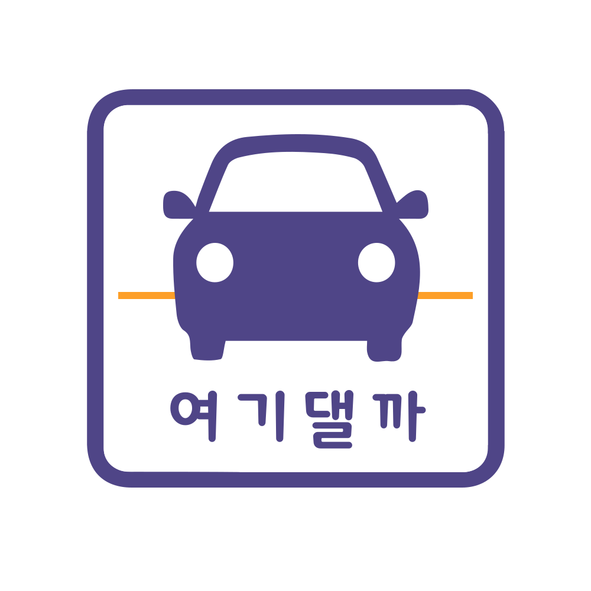

# 여기댈까

1. [Frontend (React)](./front_main/)
2. [Backend (Django)](./Backend/)
3. [Embedded (Python)](./Embedded/)
---
 

## 서비스컷

 

## 주차장 인식 원리

 

## 사용한 기술 스택
 

## 프로젝트 기능도
 

## ERD

## 산출물
[와이어프레임](./Outputs/SUB2/22.07.18/여기댈까 WireFrame.pdf)
[화면정의서](./Outputs/SUB2/22.07.18/여기댈까 화면정의서.pptx)
[기능별 시퀀스](./Outputs/SUB2/3팀_기능별시퀀스.pdf)
